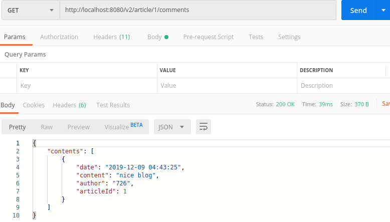

##Web服务端开发

###后端框架
在设计好API后，通过swagger-editor来快速生成一个代码包，其中自动编写好了可自动化的路由匹配、匹配函数调用、结构体定义等，只需要在函数里补充功能代码，大大节省了工作量。

包结构如下：
```
- go-server-server
	- api
		- swagger.yaml
	- go
		- api_article.go
		- api_user.go
		- logger.go
		- model_article_response.go
		- model_article.go
		- model_articles_response.go
		- model_body.go
		- model_comment.go
		- model_comments.go
		- model_inline_response_200.go
		- model_inline_response_404_1.go
		- model_inline_response_404.go
		- model_tag.go
		- model_user.go
		- routers.go
		- README.md
	- main.go
```
routers.go，自动实现了路由匹配和函数调用
```
type Route struct {
	Name        string
	Method      string
	Pattern     string
	HandlerFunc http.HandlerFunc
}

type Routes []Route

func NewRouter() *mux.Router {
	router := mux.NewRouter().StrictSlash(true)
	for _, route := range routes {
		var handler http.Handler
		handler = route.HandlerFunc
		handler = Logger(handler, route.Name)

		router.
			Methods(route.Method).
			Path(route.Pattern).
			Name(route.Name).
			Handler(handler)
	}

	return router
}

func Index(w http.ResponseWriter, r *http.Request) {
	fmt.Fprintf(w, "Hello World!")
}

var routes = Routes{
	Route{
		"Index",
		"GET",
		"/v2/",
		Index,
	},
	......
}
```
model_article.go，自动定义好了article机构体
```
type Article struct {

	Id int32 `json:"id"`

	Name string `json:"name"`

	Tags []Tag `json:"tags,omitempty"`

	Date string `json:"date,omitempty"`

	Content string `json:"content"`
}

```
api_article.go，自动定义好了对应函数，我们只需要在其中补全功能代码
```
func GetArticleById(w http.ResponseWriter, r *http.Request) {
	w.Header().Set("Content-Type", "application/json; charset=UTF-8")
	w.WriteHeader(http.StatusOK)
}

func GetArticles(w http.ResponseWriter, r *http.Request) {
	w.Header().Set("Content-Type", "application/json; charset=UTF-8")
	w.WriteHeader(http.StatusOK)
}

func GetCommentsOfArticle(w http.ResponseWriter, r *http.Request) {
	w.Header().Set("Content-Type", "application/json; charset=UTF-8")
	w.WriteHeader(http.StatusOK)
}
```
###功能实现
代码较长，这里只说明关键的要点，详细代码见文件
- json的序列化和反序列化
前后端是通过json来作为请求request和响应的response
服务端收到请求时，将json请求反序列化为结构体
```
	//把json反序列化为结构体
	err = json.Unmarshal(v, &article)
	
	//把请求中的json反序列化为结构体，函数会根据变量名自动赋值
	comment := &Comment{
		Date:  time.Now().Format("2006-01-02 15:04:05"),
		Content: "",
		Author: "",
		ArticleId: int32(Id),
	}
	err = json.NewDecoder(r.Body).Decode(&comment)
```
服务端发送响应时，将结构体序列化为json
```
json, err := json.Marshal(response)
```
- BoltDB数据库的使用
  - 打开数据库，若不存在则会自动创建
```
	db, err := bolt.Open("test.db", 0600, nil)
    if err != nil {
        log.Fatal(err)
	}
```
  - 创建表，更新数据库必须使用update方法
```
	err = db.Update(func(tx *bolt.Tx) error {
		CommentsTable := tx.Bucket([]byte("comments"))
		if CommentsTable == nil {
		//create users table
			_, err := tx.CreateBucket([]byte("comments"))
			if err != nil {
				//insert data
				log.Fatal(err)
			}
		}
	}
```
  - 插入数据，boltdb是简单的k-v存储方法
```
	err = db.Update(func(tx *bolt.Tx) error {
		ArticlesTable := tx.Bucket([]byte("articles"))
		it := &Article {
			Id: 1,
			Name: "【LeetCode】128. Longest Consecutive Sequence",
			Date: "2018-12-16 13:07:57",
			Content: "resource/【LeetCode】128. Longest Consecutive Sequence.md",
		}
		jsons, _ := json.Marshal(it)
		ArticlesTable.Put([]byte(strconv.Itoa(int(it.Id))), jsons)
	}
```
  - 查找数据，查找数据可以用只读的view方法
```
	db.View(func(tx *bolt.Tx) error {
		b := tx.Bucket([]byte("articles"))
		v := b.Get([]byte(articleId))
	}
```

###postman测试
1. 获取文章列表

2. 按id获取文章

3. 用户注册


 - 正常注册


 - 重复的用户

4. 用户登录


 - 正常登录（返回token)


 - 错误的用户名称或密码

5. 评论

6. 获取评论
